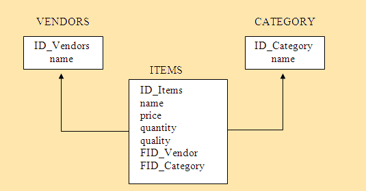
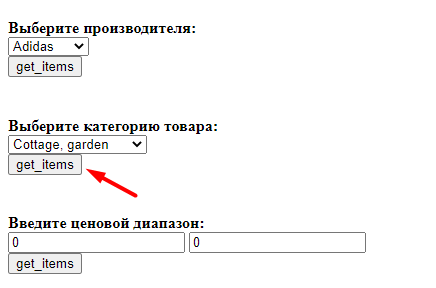

# LABS.ITECH
LAB 1 ITECH

Создать и заполнить произвольными данными БД для хранения информации о товарах в интернет–магазине.

Схема БД:

Для товара задается название, фирма-производитель, категория товара (процессоры, материнские платы и т.д.), цена товара, количество единиц на складе.
Сформировать запросы и вывести результаты:
товары выбранного производителя;
товары выбранной категории;
товары в выбранном ценовом диапазоне.

Выбираем производителя и нажимаем 'get_items':

Получаем страницу с результатом:

Выбираем категорию товара и нажимаем 'get_items':

Получаем страницу с результатом:

Вводим ценовой диапазон товара(5000 - 15000) и нажимаем 'get_items':

Получаем страницу с результатом:

Вводим ценовой диапазон товара(0 - 0) и нажимаем 'get_items':

Получаем страницу с результатом(нет товаров в выбраном диапазоне):

