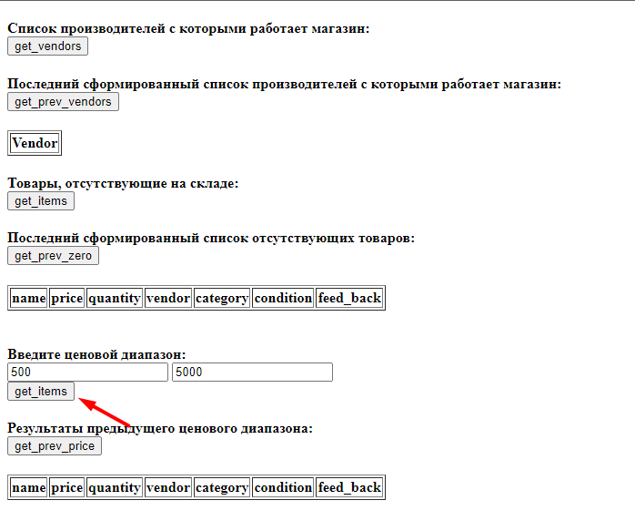
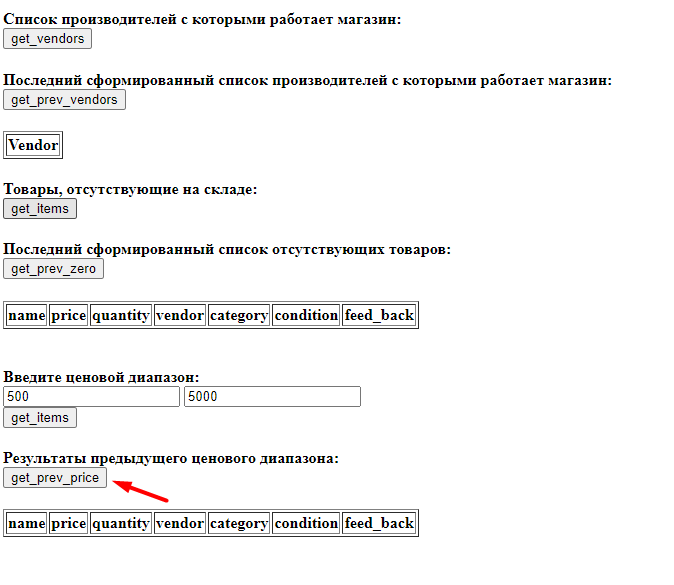

# LABS.ITECH
LAB 2 ITECH

Нажимаем на кнопку 'get_vendors', чтобы получить список производителей:

Получен список производителей:

Нажимаем на кнопку 'get_prev_vendors', чтобы получить последний сформированый список производителей:

Получен последний сформированый список производителей:

Нажимаем на кнопку 'get_items', чтобы получить товары отсутствующие на складе:

Получены товары отсутствующие на складе:

Нажимаем на кнопку 'get_prev_price', чтобы получить товары в заданом диапазоне из последнего сделаного запроса:

Получаем сообщение, так как запрос на выборку товаров в ценовом диапазоне ранее не проводился:

Вводим ценовой диапазон(500 - 5000) и нажимаем на кнопку 'get_items':

Получены товары в заданом ценовом диапазоне(500 - 5000):

Нажимаем на кнопку 'get_prev_price', чтобы получить товары получить товары в заданом диапазоне из последнего сделаного запроса:

Получены товары в заданом ценовом диапазоне из последнего сделаного запроса:

